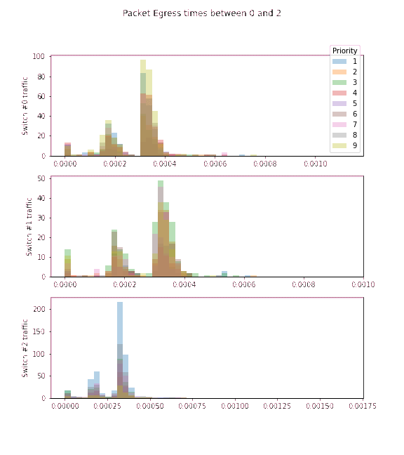

# COS561 Final Project: Dissecting DeepQueueNet
For this project, we aimed to reproduce the [DeepQueueNet](https://dl.acm.org/doi/abs/10.1145/3544216.3544248) paper, 
which aims to use deep learning to simulate per device packet queueing times in a discrete event simulator (DES). 
Standard DES's, such as [ns-3](https://www.nsnam.org/) or [ns.py](https://github.com/TL-System/ns.py), lack the 
scaleability necessary to be practical for modern networks, which can have hundreds of nodes in the topology, and switches
with many ports. Deep learning affords us the opportunity for device level parallelization and the ability to process 
packets in batches, without sacrificing the fine-grainedness of the simulator (as with EPE's or continuous simulators).
Below we show animated histograms showing the simulated queueing times for ns.py (left) vs. our implementation of 
DeepQueueNet (right) using a variety of different schedulers. The traffic for these plots was generated using a Poisson 
process. 

### Switches with FIFO scheduling:

  
   

### Switches with SP scheduling:

  
   

### Switches with DRR scheduling:

  
   

### Switches with WFQ scheduling:

  
   

## Generating data using ns.py 
**NOTE: Currenty, only the fattree topology is supported for data generation/training/inference**

In order to run a simulation, we can use `src/data_gen.py` to run a simulation using `ns.py` to create ground truth traces.
The command-line arguments for the data generation are specified here; all options apply to all switches in the network:
* `--port-rate` : Port Rate in bits per second (default: 50 Mbps)
* `--buffer-size` : Buffer Size in bytes (default: 100 KB)
* `--mean-pkt-size` : Mean packet size in bytes (default: 1000B)
* `--scheduler` : which packet schedueler to use. Options are FIFO, SP, DRR, and WFQ. (default: FIFO)
* `--traffic-gen` : which type of traffic generation to use. Options are Poisson or OnOff. (default: Poisson)
* `--num-ports` : Number of ports per switch. (default: 4)
* `--num-flows` : Number of flows to generate. (default: 100)
* `--duration` : How long the simulation should last in seconds (default: 30 seconds)
* `--output-dir` : Which folder the output traces should be written to. (default: data)
* `--output-name` : Name of output trace. (default: rsim)

<!-- ### Setting Up
1. Create a new virtual environment using `conda create --name dqn --file environment.yml`
2. Activate environment using `conda activate dqn`

### Download Anarchy Data
1. Create a data directory with `mkdir data`
2. `cd data`
3. Download Anarcy PCAP data with `wget https://datasets.simula.no/downloads/anarchy-online-server-side-packet-trace-1hr.pcap`

### Download Data
1. Install gdown with `pip install gdown`
2. `cd data`
3. Download raw data with `gdown https://drive.google.com/uc?id=142hbD3ZWDJ7Lqh_SuOuFzwZPgsJ9BzxT` and processed data with `gdown https://drive.google.com/uc?id=1-YqHXIkfFYtXCysdcmoj3BgnjrLPoqvW`
4. Untar the compressed files with `tar -xvzf raw_data.tar.gz` and `tar -xvzf processed_data.tar.gz` -->